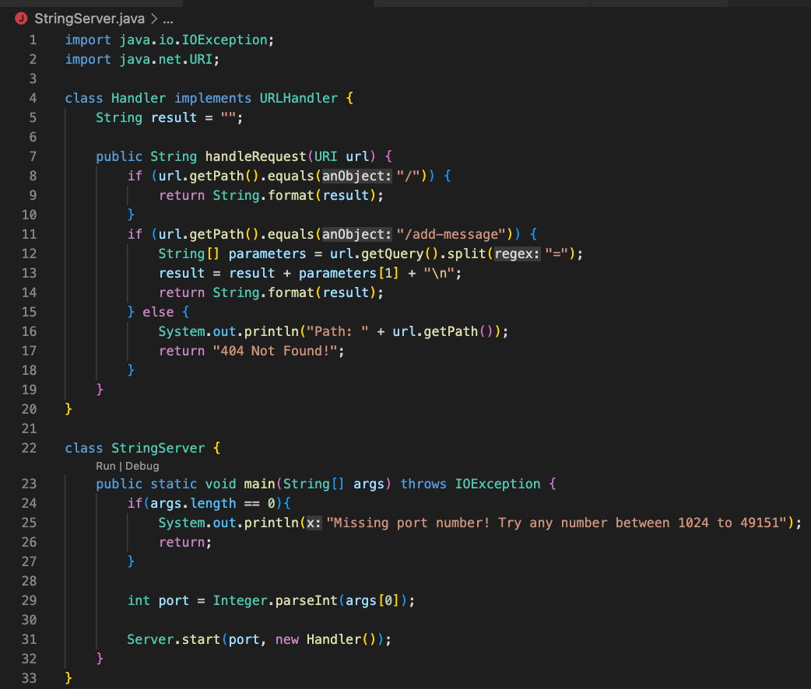
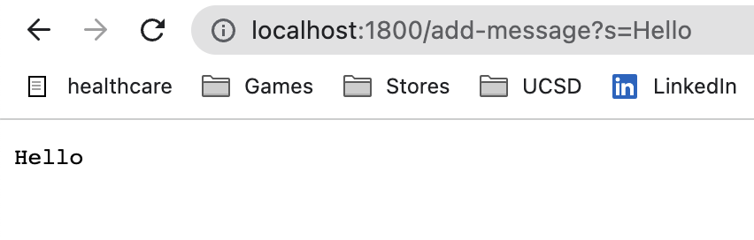
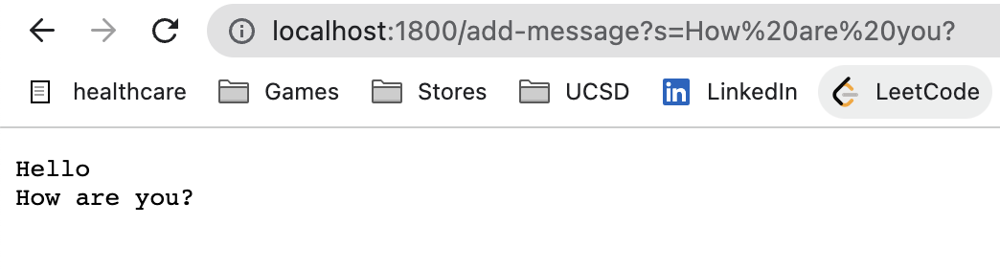
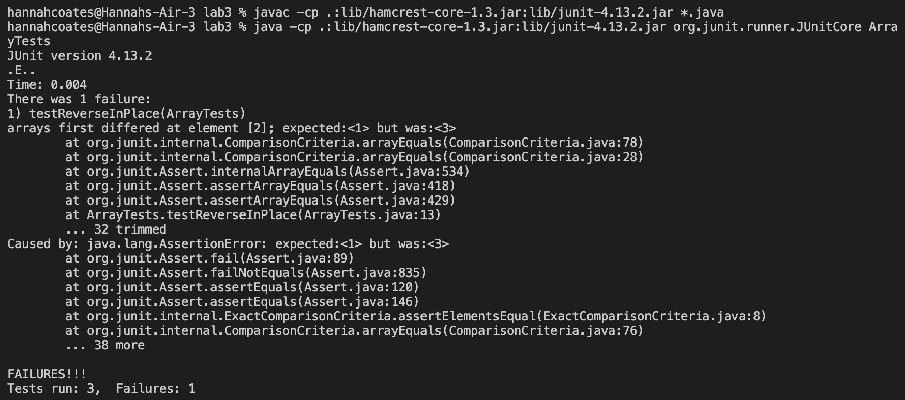

Lab Report 2
==========


Table of Contents
--------------

* Part 1 : String Server
* Part 2 : Bugs
* Part 3 : New Concepts

Part 1: String Server
--------

**Code for StringServer:**



**Screenshots of using /add-messages:**



_Which methods in your code are called?_

The methods in my code that get called are main method in the StringServer class and handleRequest in the Handler class.

_What are the relevant arguments to those methods, and the values of any relevant fields of the class?_

The relevant arguments for the main method is the args String input that is the port used for creating the server. The relevant arguments for the handleRequest method are String result which holds a single string that gets added to by incoming requests found in the path. The other relevant value in handleRequest is String[] parameters which holds the query value found in the url.

_How do the values of any relevant fields of the class change from this specific request? If no values got changed, explain why._

In this specific request the args[0] value in the main method is set to 1800 and the port value is set to 1800. The result value in handleRequest method concats Hello and a new line value the String which is returned and displayed on the web server. Parameters adds s and Hello to its string array.



_How do the values of any relevant fields of the class change from this specific request? If no values got changed, explain why._

In this specific request the args[0] value in the main method is set to 1800 and the port value is set to 1800. The result value in handleRequest method concats How are you? and a new line value the String which is returned and displayed on the web server. Parameters adds s and How are you? to its string array.

Part 2: Bugs
------

**A failure-inducing input for the buggy program, as a JUnit test and any associated code:**
````
@Test 
public void testReverseInPlace() {
  int[] input2 = { 1, 2, 3 };
  ArrayExamples.reverseInPlace(input2);
  assertArrayEquals(new int[]{ 3, 2, 1 }, input2);
}
````
**An input that doesn’t induce a failure, as a JUnit test and any associated code:**
````
@Test 
public void testReverseInPlace() {
  int[] input1 = { 3 };
  ArrayExamples.reverseInPlace(input1);
  assertArrayEquals(new int[]{ 3 }, input1);
}
````
**The symptom, as the output of running the tests:**



**The bug, as the before-and-after code change required to fix it:**

Before:
````
static void reverseInPlace(int[] arr) {
  for(int i = 0; i < arr.length; i += 1) {
      arr[i] = arr[arr.length - i - 1];
  }
}
````

After:
````
static void reverseInPlace(int[] arr) {
  int[] temp = arr.clone();
  for(int i = 0; i < arr.length; i += 1) {
    arr[i] = temp[arr.length - i - 1];
  }
}
````

Briefly describe why the fix addresses the issue:

By adding a temporary int array it allows arr to be reversed without losing any values in arr. When there is no temp used in order to reverse arr it will loose the first value that is switched and therefore not reversing the array fully because the first value will be lost.


Part 3: New Concepts
------

In a couple of sentences, describe something you learned from lab in week 2 or 3 that you didn’t know before.

In lab 2 we created our own web servers. Prior to this lab I did not know how to create a web server and access different parts of the URL. Through lab 2, I was able to practice making a webserver and searching the url for the path and queries which I did not know how to do before. Also through this lab I learned the different parts of the URL and developed a better understanding of how each part is utilized by the server.
