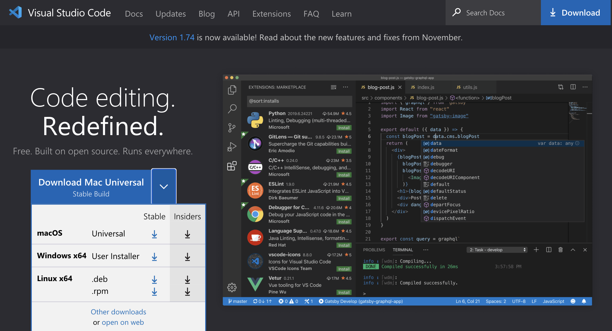
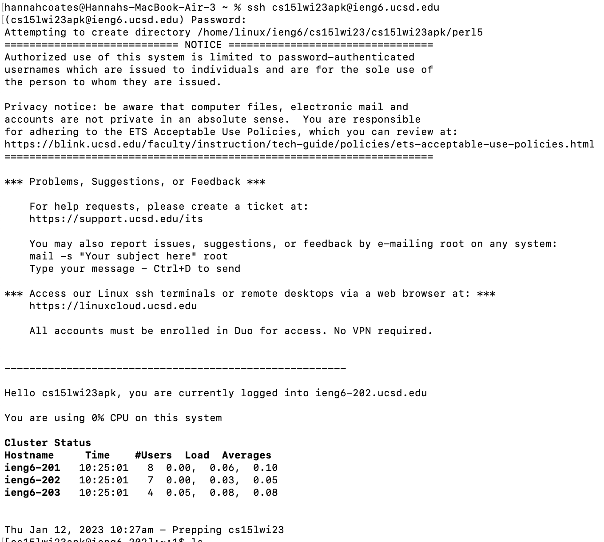

Lab Report 2
==========

Table of Contents
--------------

* Part 1 : String Server
* Part 2 : Bugs
* Part 3 : New Concepts

Part 1: String Server
--------

1. Go to the [VSCode Website](https://code.visualstudio.com/) 

2. Download the version for your specific operating system, once its downloaded VSCode should look like this

Part 2: Bugs
------

1. Look up your course specific account using [this link.](https://sdacs.ucsd.edu/~icc/index.php)

2. Here you will find your course specific account, it should start with cs15Lwi23
3. Click the password reset login and follow the instructions to reset your password, selecting "no" for changing the tritonlink password
4. Open up terminal on your mac
5. In your terminal type: ssh Your_Account@ieng6.ucsd.edu (replacing Your_Account with your course specific account)
6. Since its your first time remote connecting it will ask "Are you sure you want to continue connecting (yes/no/[fingerprint])?", type yes
7. Enter your password to the password prompt, no text should appear as you type your password
8. You should have something similar to this output once you've successfully connected, to logout you can run exit or ctrl + d

Part 3: New Concepts
------

In lab 

